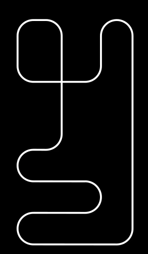

# 🚗 Line Follower Simulator — Simulador com PID + Otimização por Algoritmo Genético

Simulador em **Pygame** de um robô seguidor de linha com controle **PID** e um script de otimização automática dos ganhos `Kp`, `Ki` e `Kd` usando **Algoritmo Genético** via [pymoo](https://pymoo.org/).  
O objetivo da otimização é encontrar parâmetros que permitam **completar a pista no menor tempo possível**, aplicando penalizações quando o robô sai da pista ou não termina no tempo limite.

---

## 📁 Estrutura do Repositório

```
.
├── line-follower.py      # Simulador principal em Pygame
├── galf.py               # Otimização de Kp, Ki, Kd com Algoritmo Genético
├── circuit_1.png         # Pista usada no simulador
├── basecode.cpp          # Código de referência (C++)
└── README.md             # Este arquivo
```

---

## 🛠️ Requisitos

- Python 3.8 ou superior
- Dependências:
```bash
pip install pygame numpy matplotlib pymoo
```

Se preferir, use um **ambiente virtual**:
```bash
python -m venv .venv
source .venv/bin/activate       # Linux / macOS
.\.venv\Scriptsctivate        # Windows (PowerShell)
```

---

## ▶️ Como Executar

### 1️⃣ Simulador (modo visual)
```bash
python line-follower.py
```
- Use as setas do teclado no modo manual.
- No modo automático, os ganhos `Kp`, `Ki`, `Kd` definidos no código controlam o robô.

### 2️⃣ Otimização com Algoritmo Genético
```bash
python galf.py
```
- Cada indivíduo do GA representa um conjunto de parâmetros `(Kp, Ki, Kd)`.
- A função de avaliação executa o simulador e mede o tempo para completar a pista.
- O objetivo é minimizar o tempo total.

---

## 📷 Exemplo de Execução



---

## 📜 Licença
Este projeto é distribuído sob a licença MIT. Veja o arquivo LICENSE para mais detalhes.
